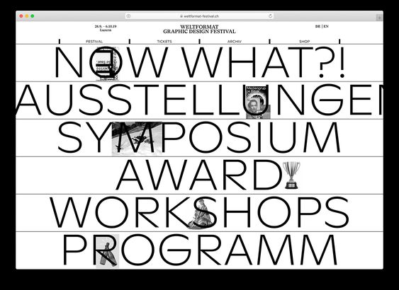
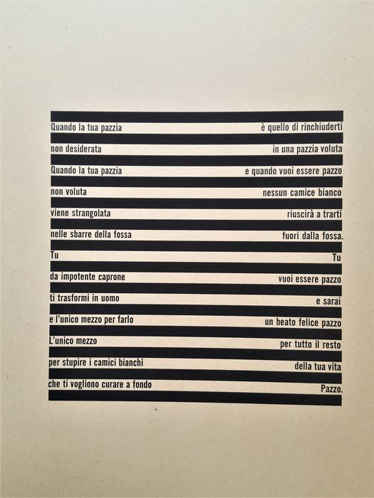
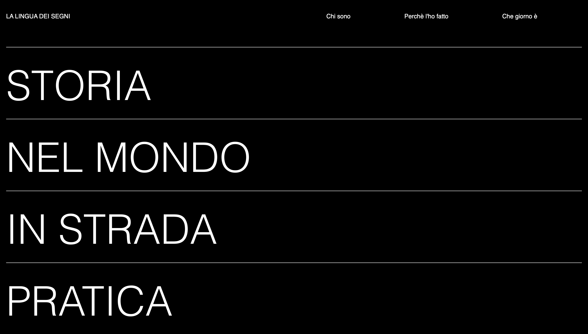
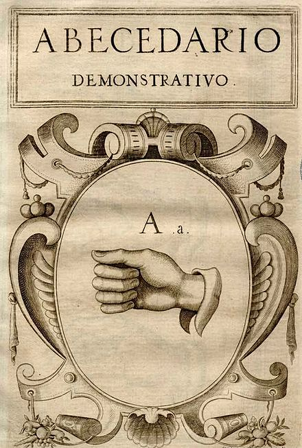
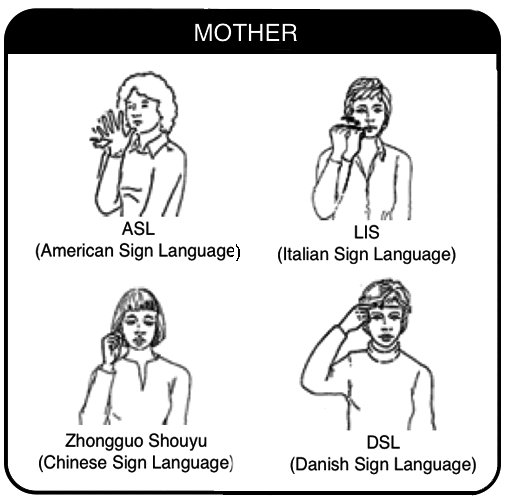
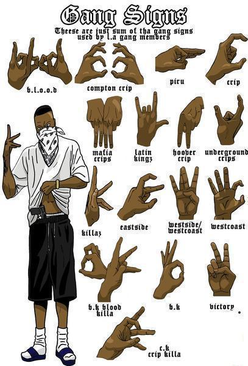
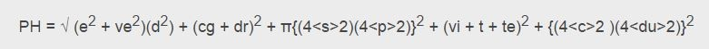

SUPSI 2022-23  
Corso d’interaction design, CV427.01  
Docenti: A. Gysin, G. Profeta  

Elaborato 2: Antologia a due mani

# Lingua_dei_segni
Autrice: Giorgia Langianese 
[MediaPipe demo-ES6](https://ixd-supsi.github.io/2023/esempi/mp_hands/es6/1_landmarks)


## Introduzione e tema
L'obiettivo di questo elaborato è stato creare una pagina web interattiva, che spiegasse alcune caratteristiche principali del tema scelto. Il tema che ho deciso di portare all'interno del sito è stato quello della lingua dei segni.
La scelta delle caratteristiche da evidenziare (rispetto alla tematica principale) è stata autonoma, rendendo così la ricerca ancora più interessante e anche molto utile, in quanto personalmente mi ha permesso di espandere le mie conoscenze. 


## Riferimenti progettuali
Per lo sviluppo di questo progetto, ho inizialmente effettuato una ricerca sul web per trovare fonti di riferimento.
Dopo aver trovato delle prime reference, il Professor Gysin mi ha suggerito un altro possibile riferimento, specificamente un estratto del libro intitolato "Della pazzia" scritto da Sambonet. In questo modo, ho potuto ampliare le mie conoscenze, ottenendo un supporto sia dalla ricerca personale online che dai consigli del docente.


[]()
[]()


## Design dell’interfraccia e modalià di interazione
Il design del sito si caratterizza per un aspetto minimalista e moderno. L'elemento dominante è lo sfondo nero, che crea un forte contrasto e mette in risalto gli elementi chiave. I titoli dei paragrafi sono molto grandi e di colore bianco, in modo da essere ben visibili sullo sfondo scuro; questa scelta tipografica enfatizza la loro importanza e li rende facilmente leggibili.
Per suddividere i titoli e creare una struttura visiva tra le sezioni, sono presenti dei filetti orizzontali piuttosto sottili.
Quando si clicca su uno dei titoli, si apre una finestra dropdown che mostra una spiegazione dettagliata e un'immagine correlata. Questa funzionalità permette agli utenti di accedere rapidamente alle informazioni desiderate, mantenendo allo stesso tempo un layout pulito.

Complessivamente, il design di questo sito è caratterizzato da uno sfondo nero, titoli grandi di colore bianco, filetti orizzontali per la suddivisione, dropdown per le spiegazioni e immagini, e una disposizione chiara dei quattro titoli principali, offrendo agli utenti un'esperienza visivamente coinvolgente e intuitiva all'interno del tema della lingua dei segni.


[]()


## Tecnologia usata
Per lo sviluppo di questo progetto è stata impiegata esclusivamente la tecnologia del linguaggio HTML.


```HTML
<!DOCTYPE html>
<html>
<head>
	<meta charset="utf-8">
	<title>La Lingua dei Segni</title>
	<meta name="author" content="Giorgia Langianese">
	<meta name="copyright" content="2023">
	<meta name="description" content="Titolo Pagina: descrizione">
	<meta name="viewport" content="width=device-width, initial-scale=1">
    <link rel="icon" href="./icons/icon.svg" type="image/svg+xml">
	<link rel="icon" href="./icons/icon_48.png" type="image/png">
	<link rel="shortcut icon" href="./icons/icon_48.png" type="image/png">
	<link rel="apple-touch-icon" href="./icons/icon_180.png" type="image/png">
        <script 
        src="https://cdn.jsdelivr.net/npm/p5@1.6.0/lib/p5.js">
        </script>
        <script src="sketch.js"></script>


    <title>w3.css demo</title>
            <meta name="viewport" content="width = device-width, initial-scale = 1">
            <link rel="stylesheet" href="https://www.w3schools.com/w3css/4/w3.css">

    <style>

        body {
            margin: 2em 1em;
            background-color: black;
        }

        section {            
            display: block;
            border-top: 0px solid black;
            border-bottom: 35px solid black;
        }

        .contenuto {
            max-width: 40em;
            color: white;
            font-family: sans-serif;
            border-top: 60px solid black;
            border-bottom: 10px solid black;
            

        }

        .testata {
            display: block;
            background-color: black;
            height: 1em;
            cursor: pointer;
            color: white;
            font-family: sans-serif;
            font-size: 100px;
            font-weight: 100;
        }

        .chiuso {
            display: none;
        }


        		/* Styling for the dropdown window */
		.dropdown {
			position: relative;
			display: inline-block;
		}

		.dropdown-content {
			display: none;
			position: right;
			z-index: 1;
			opacity: 0.5;
			transition: opacity 0.5s ease;
		}

		.dropdown:hover .dropdown-content {
			display: block;
		}


        
        hr {
            border-color:white;
        }


       h3 {
            font-family: sans-serif;
            font-size: 18px;
            font-weight: 100;
            position: relative;
            left: 1100px;
        }

        .anim {
        color: white;
        transition: color 100ms;
        font-family: sans-serif;
        }

        .anim:hover {
            color: grey;
            /* font-size: 0.5em; */
        }


        p {
            font-family: sans-serif;
            color: grey;
        }

        a{
            text-decoration: none ;
        }
        
          


        h4 {
            font-family: sans-serif;
            font-size: 18px;
            font-weight: 100;
            position: relative;
            left: 800px;
            top: 20px;
        }

        .immagine {
            position: static;
            right: 40px;
            margin-top: 60px;

        }

        .immaginedap {
            filter: invert(1);
        }

       /* img { 
            position: relative;
            left: 800px;
            top: -470px;
        }*/

    </style>
</head>

<body>


    <section>
     
        <div class="w3-dropdown-hover w3-black">	 
            <div class="anim niente">
            <a href="https://ixd-supsi.github.io/2023/">LA LINGUA DEI SEGNI</a>
         </div>
        </div>
        &nbsp;    
        &nbsp;
        &nbsp;
        &nbsp;
        &nbsp;
        &nbsp;
        &nbsp;
        &nbsp;
        &nbsp;
        &nbsp;
        &nbsp;
        &nbsp;
        &nbsp;
        &nbsp;
        &nbsp;
        &nbsp;
        &nbsp;
        &nbsp;
        &nbsp;
        &nbsp;
        &nbsp;
        &nbsp;
        &nbsp;
        &nbsp;
        &nbsp;
        &nbsp;
        &nbsp;
        &nbsp;
        &nbsp;
        &nbsp;
        &nbsp;
        &nbsp;
        &nbsp;
        &nbsp;
        &nbsp;
        &nbsp;
        &nbsp;
        &nbsp;
        &nbsp;
        &nbsp;
        &nbsp;
        &nbsp;
        &nbsp;
        &nbsp;
        &nbsp;
        &nbsp;
        &nbsp;
        &nbsp;    
        &nbsp;
        &nbsp;
        &nbsp;
        &nbsp;
        &nbsp;
        &nbsp;
        &nbsp;
        &nbsp;
        &nbsp;
        &nbsp;
        &nbsp;
        <div class="w3-dropdown-hover w3-black">	 <div class="anim">Chi sono</div>
        <div class="w3-dropdown-content w3-black w3-padding">LNGGRG01S52C933F <BR> 12.11.2001</div>
        </div>
        &nbsp;
        &nbsp;
        &nbsp;
        &nbsp;
        &nbsp;
        &nbsp;
        &nbsp;
        &nbsp;
        &nbsp;
        &nbsp;
        &nbsp;
        &nbsp;
        <div class="w3-dropdown-hover w3-black">	 <div class="anim">Perchè l'ho fatto</div>
        <div class="w3-dropdown-content w3-black w3-padding">CV427.01<BR> SUPSI - DACD</div>
        </div>
        &nbsp;
        &nbsp;
        &nbsp;
        &nbsp;
        &nbsp;
        &nbsp;
        &nbsp;
        &nbsp;
        &nbsp;
        &nbsp;
        &nbsp;
        &nbsp;
        <div class="w3-dropdown-hover w3-black">	 <div class="anim">Che giorno è</div>
        <div class="w3-dropdown-content w3-black w3-padding"><display id="date"></select></div>
        </div>
        <script>
            var today = new Date();
            var date = today.toLocaleDateString();
            document.getElementById("date").innerHTML = date;
          </script>

    
<br>
<br>
<br>
<hr>


    <section>
        <div class="testata anim">STORIA</div>
        <div class="chiuso"> 
        <div class="contenuto">
            La lingua dei segni sfrutta il canale visivo-gestuale: il messaggio viene espresso con il corpo e percepito con la vista.

            Le lingue dei segni sono lingue che veicolano i propri significati attraverso un sistema codificato di segni delle mani, espressioni del viso e movimenti del corpo. 
            Sono utilizzate dalle comunità formate in maggioranza da persone sorde. È una forma di comunicazione che contiene aspetti verbali (i segni) e aspetti non verbali (le espressioni sovrasegmentali di intonazione per esempio) come tutte le lingue parlate o dei segni. 
            Una recente ricerca di meta-analisi, che utilizza diversi metodi di neuroimaging, ha dimostrato che i segni vengono elaborati nelle reti cerebrali e si sovrappongono allo sviluppo del linguaggio parlato.
            <br>
            <br>
            Il termine "lingua dei segni" viene utilizzato per indicare la forma di comunicazione utilizzata dalle persone sorde o ipoudenti, e viene preferito al termine "linguaggio dei segni" perché "lingua" sottolinea il fatto che si tratta di una forma di comunicazione completa e complessa, con una grammatica e una sintassi proprie, come qualsiasi altra lingua naturale.

            Inoltre, il termine "linguaggio" viene spesso associato alla comunicazione verbale, mentre la lingua dei segni è una forma di comunicazione visuale e gestuale. Il termine "lingua dei segni" sottolinea quindi l'importanza e la complessità di questa forma di comunicazione, e la sua natura di lingua a tutti gli effetti.
            <br>
            <br>

            La comunicazione visiva dei sordi è nota sin dall'antichità, anche se le notizie su quello che allora veniva chiamato “linguaggio mimico o dei gesti” sono molto frammentarie. Il primo a descrivere nei suoi scritti in modo più sistematico la lingua dei segni, usata dai suoi studenti sordi, fu l'educatore e fondatore della Scuola di Parigi per sordi, l’Abbè de L’Eppè. 
            Nella seconda metà del 1700, decide di utilizzare questa forma di comunicazione per insegnare la lingua scritta e parlata aggiungendo dei segni da lui creati corrispondenti ad elementi grammaticali e sintattici della lingua francese. 

            Sicard, successore di L'Épée, è stato un grande studioso della lingua dei segni e in generale tra gli illuministi francesi, nello stesso periodo, si può riscontrare un interesse per i diversi aspetti della comunicazione umana. Lo statunitense Thomas Hopkins Gallaudet, si reca in Francia e dopo un anno di tirocinio presso l'istituto dei sordi di Parigi, decide di ritornare in patria nel 1816. Nel viaggio di ritorno in nave durato un anno impara la lingua dei segni francese. Gallaudet ha portato negli Stati Uniti la lingua dei segni francese, che si diffonde grazie alla nascita di istituti per sordi, e le somiglianze tra le due lingue sono ancora oggi significative. 


            William Stokoe, un ricercatore americano, fu il primo a dimostrare che questa forma di comunicazione non è una semplice mimica, ma una vera lingua, con un suo lessico e una sua grammatica, in grado di esprimere qualsiasi messaggio.
            <br>
            <br>
            <p>Fonti: <a href="https://it.wikipedia.org/wiki/Lingua_dei_segni"><u>Wikipedia</u></a>
            <br>
            &nbsp; 
            &nbsp;
            &nbsp;
            &nbsp;
            &nbsp;

            <a href="https://www.treccani.it/enciclopedia/le-lingue-dei-segni-nel-mondo_%28XXI-Secolo%29/"><u>Treccani</u></a></p>
        </div>
    </div>
    </section>
    

<hr>
        
    <section>
        <div class="testata anim">NEL MONDO</div>
        <div class="chiuso"> 
        <div class="contenuto">
            Pensando al linguaggio dei segni tutti prima o poi si sono posti la domanda: perchè non esiste una lingua dei segni universale? Bene, adesso ve lo spiego. 
            Le persone sorde non comunicano semplicemente con i gesti: usano un linguaggio complesso con una grammatica altrettanto complessa, che può esprimere ogni genere di concetto, da quelli concreti a quelli altamente astratti. 
            Per questo il linguaggio dei segni non è universale: ogni comunità di sordi ha la sua lingua, radicata nella cultura in cui si è sviluppata. 
            <br>
            <br>
            In alcune zone del mondo più paesi condividono la stessa lingua dei segni, come ad esempio Serbia e Croazia oppure India e Pakistan. 
            
            In Italia, la lingua dei segni comunemente utilizzata è la LIS (Lingua dei Segni Italiana). Si tratta di una lingua esistita per secoli, anche se le prime ricerche linguistiche a riguardo sono state avviate solo a partire dagli anni ’60. 
            Un gruppo di studiosi ha analizzato le strutture utilizzate nella Lingua dei Segni Italiana per descrivere eventi, oggetti, concetti. Molto importante è la componente "faccia-a-faccia", che ha conferito una certa iconicità ad alcuni segni della LIS: ad esempio il segno "tavolo" è eseguito a mano aperta, con un movimento che sembra indicarne la superficie.
            
            <br>
            <br>
            Poiché le lingue dei segni si sviluppano all’interno delle comunità di non udenti, possono essere indipendenti dalla lingua parlata del paese. L’American Sign Language (ASL) è infatti molto diversa dalla British Sign Language (BSL), nonostante in entrambi i paesi si parli inglese. Detto questo, 
            esiste un contatto tra la lingua dei segni e la lingua parlata (le persone sorde leggono e scrivono o leggono le labbra nella lingua parlata nel proprio paese), e le lingue dei segni riflettono questo contatto. 
            
            Il database internazionale delle lingue Ethnologue, consultabile on-line, enumera 121 diverse lingue dei segni.

            Circa trent’ anni fa venne creata una Commissione Internazionale di esperti della Federazione Mondiale dei sordi che, nel 1975, pubblicò un volume contenente una lista di segni "internazionali".L’obiettivo era quello di creare una sorta di lingua dei segni condivisibile a livello mondiale. 
            Trattandosi però di una proposta esclusivamente lessicale non poté mai acquisire le caratteristiche di una vera lingua; in tempi alquanto rapidi andò incontro ad un totale fallimento così come successe all’ esperanto per quanto riguarda 
            le lingue vocali.Una lingua infatti non può essere creata artificiosamente, "a tavolino" come si suol dire, ma scaturisce dalle vere esigenze comunicative di una intera comunità che in essa riflette la propria storia ed i propri valori culturali.
            <br>
            <br>
            <p>Fonti: <a href="https://medicinaonline.co/2018/08/28/lingua-dei-segni-italiana-cose-e-come-impararla/"><u>MedicinaOnline</u></a>
                <br>
                &nbsp; 
                &nbsp;
                &nbsp;
                &nbsp;
                &nbsp;

                <a href="https://www.igeacps.it/la-lingua-dei-segni-e-universale/"><u>IgeaCPS</u></a></p>
        </div>
    </section>

<hr>

    <section>
        <div class="testata anim">IN STRADA</div>
        <div class="chiuso"> 
        <div class="contenuto">
            Intorno al 1900 viene bloccata la diffusione della lingua dei segni in ambito educativo: proibita nelle classi, ma diffusa nei corridoi, la lingua dei segni patì un impoverimento linguistico 
            ma soprattutto mancanza di consapevolezza che la lingua dei segni italiana costituisca la lingua madre dei sordi. In tutti i paesi, comunque, la lingua dei segni inizia ad essere studiata da un punto di vista linguistico solo a partire dagli anni sessanta.
            <br>
            <br>
            I segni delle bande possono funzionare in modo simile al linguaggio dei segni, con alcuni gesti che denotano l’intenzione o l’azione, o altri che mostrano la fedeltà o l’alleanza con una particolare banda. 
            Può anche essere un gesto minaccioso o un tentativo di durezza, per spaventare rivali o passanti non appartenenti al gruppo.
            <br>
            <br>
            Ogni saluto ad esempio nasconde un messaggio che è un importantissimo metodo di comunicazione non verbale. 
            Tra le varie tipologie di saluti informali, il “dap” è uno dei più affascinanti. 
            Per chi non lo conoscesse, può essere descritto come un’elaborata combinazione di strette di mano, pugni che si toccano, e movimenti sinuosi delle mani. 
            Ognuno può personalizzarlo a piacere, rendendo unico il legame tra due o più persone appartenenti allo stesso gruppo.
            Il termine “dap” prende origine da un termine vietnamita che sta ad indicare “qualcosa di bello”.
            <br>
            <br>
            Tra le infinite combinazioni di strette di mano e mosse con le dita, qualcuno si è però preso la briga di studiare matematicamente il problema. Il professore Geoffrey Beattie della Manchester University ha dunque ricavato nel 2010 la formula del saluto perfetto:
            <br>
            
            <br>        
            Ogni lettera corrisponde ad un particolare gesto. Ad esempio, la “e” corrisponde al contatto visivo e può avere un valore compreso tra 1, niente sguardo, e 5, sguardo diretto; la lettera “s” si riferisce alla forza della stretta di mano e così via. L’elenco completo di queste strane variabili si può trovare qui. 
            <br>
            <br>
            <p>Fonti: <a href="https://www.essemagazine.it/news/siamo-davanti-alla-fine-del-dap "><u>EsseMagazine</u></a></p>
        </div>
    </section>

<hr>

    <section>
        <div class="testata anim">PRATICA</div>
        <div class="chiuso"> 
        <div class="contenuto"> 
            Per imparare la lingua dei segni prima cosa leggi e comprendi l’alfabeto.
            <br>
            Successivamente impara a replicare i segni base.
            <br>
            Impara a mescolare duo o più termini base per costruire piccole frasi di senso compiuto.
            <br>
            Quando avrai familiarizzato con i termini base, 
            <br>aggiungi nuove parole all’elenco dei segni che conosci.
            <br>
            <br>
            <p>Fonti: <a href="http://chat.openai.com"><u>ChatGPT</u></a></p>
        </div>
    </section>

<hr>
    <script>
        document.querySelectorAll(".testata").forEach( el => {
            el.addEventListener('click', evt => {
                evt.target.nextElementSibling.classList.toggle("chiuso")
            })
        })
    </script>

</body>

```

## Target e contesto d’uso
Il possibile target di questo sito potrebbe essere composto da persone interessate alla lingua dei segni, come studenti, insegnanti, ricercatori o semplicemente individui curiosi di approfondire questo argomento.
Il contesto d'uso potrebbe variare, potrebbe essere utilizzato come risorsa di apprendimento per coloro che desiderano imparare la lingua dei segni, oppure potrebbe diventare un punto di riferimento per la ricerca, le ultime scoperte e le teorie più recenti di questo ambito.
